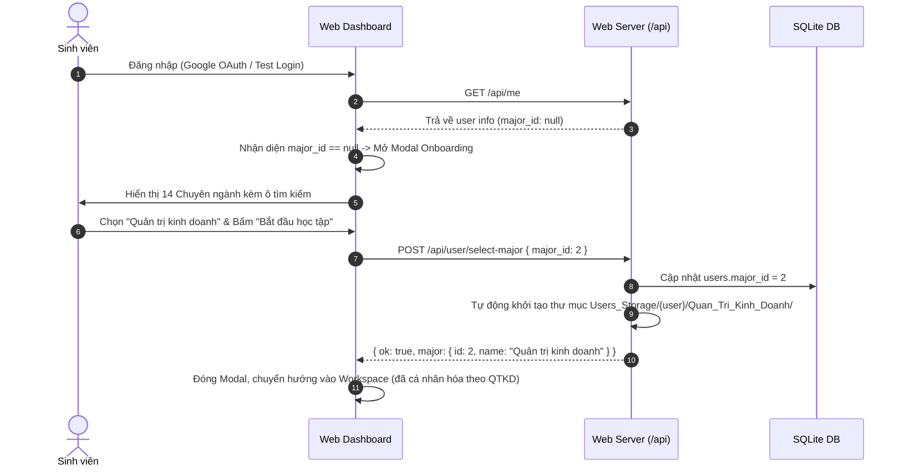

# Thiết Kế Phân Hệ Quản Trị Đa Chuyên Ngành, Onboarding Sinh Viên & Khóa Bảo Mật Nạp Tệp

> **Tài liệu đặc tả kiến trúc & thiết kế chi tiết (Design Spec Doc)**  
> **Ngày khởi tạo:** 21/09/2026  
> **Trạng thái:** Chờ phê duyệt (Pending Approval)  
> **Tác giả:** Antigravity AI Assistant & Kỹ sư trưởng hệ thống  

---

## 1. Bối Cảnh & Mục Tiêu

### 1.1. Hiện trạng
Hệ thống **ThsAutoOrganizer** hiện tại đang bị ràng buộc cố định (hardcoded) vào một chuyên ngành duy nhất là **Thạc sĩ Hệ thống thông tin (HTTT)** với 5 môn học định sẵn (*Toán khoa học dữ liệu, Cơ sở dữ liệu, Triết học, Phương pháp nghiên cứu, Phương pháp ghi chú*). Ngay cả khu vực "Thử ngay" trên Trang chủ cũng đang fix cứng một ví dụ môn học và một ngành duy nhất.

Đồng thời, tính năng **"⚡ Nạp tài liệu đa thiết bị"** cần một cơ chế bảo vệ nghiêm ngặt: người dùng bắt buộc phải đăng nhập tài khoản trước khi được phép nạp tệp hay chọn thư mục, ngăn chặn rò rỉ dữ liệu hoặc xử lý tệp vô danh.

### 1.2. Mục tiêu thiết kế
1. **Hỗ trợ Đa Chuyên ngành Thạc sĩ (Multi-Major Support):**
   - Tích hợp sẵn 14 Chuyên ngành đào tạo Thạc sĩ chuẩn mực từ tài liệu của người dùng:
     1. *Quản lý giáo dục*
     2. *Quản trị kinh doanh*
     3. *Tài chính ngân hàng*
     4. *Kế toán*
     5. *Luật kinh tế*
     6. *Văn học Việt Nam*
     7. *Ngôn ngữ Anh*
     8. *Lịch sử Việt Nam*
     9. *Tâm lý học*
     10. *Công tác xã hội*
     11. *Hóa học*
     12. *Khoa học môi trường*
     13. *Toán học*
     14. *Hệ thống thông tin*
2. **Quy chuẩn Thư mục Bất biến 4 cấp con (Source of Truth):**
   - Bất kể môn học nào thuộc chuyên ngành nào, cấu trúc thư mục con luôn luôn bất biến:
     ```text
     {Thư_Mục_Lưu_Trữ_Cá_Nhân}\
     └── {Ten_Chuyen_Nganh}\
         └── {Ten_Mon_Hoc}\
             ├── 01_Giao_Trinh
             ├── 02_Slide
             ├── 03_Tai_Lieu_Tham_Khao
             └── 04_On_Thi
     ```
3. **Phân hệ Quản trị Admin (Dành riêng cho `xuanngocit@gmail.com`):**
   - Cho phép xem, thêm, sửa danh mục các Chuyên ngành và Môn học chuẩn của từng ngành.
4. **Luồng Onboarding Sinh viên (Chọn ngành lần đầu):**
   - Sinh viên đăng nhập lần đầu tiên sẽ được chào đón bằng Modal Onboarding trang nhã phong cách Obsidian để chọn Chuyên ngành của mình.
   - Sau khi chọn, hệ thống tự động khởi tạo cây thư mục trên máy tính/Google Drive và cá nhân hóa toàn bộ Workspace theo ngành đó.
5. **Khóa Bảo Vệ Tuyệt Đối Tính Năng Nạp Tệp:**
   - Khi chưa đăng nhập: Sub-tab "⚡ Nạp & Kết nối" hiển thị Lock Card tĩnh lặng, toàn bộ nút upload/camera bị vô hiệu hóa; API `/api/upload` trả về HTTP 401 Unauthorized nếu thiếu session.
6. **Tổng Quát Hóa Trang Chủ (Multi-Major Interactive Demo):**
   - Khu vực "Thử ngay" cho phép chọn nhanh chuyên ngành thử nghiệm và phân loại mẫu đa ngành phong phú, không gò bó trong 1 môn cụ thể.

---

## 2. Kiến Trúc & Mô Hình Dữ Liệu (Data Model)

### 2.1. Bảng `majors` (Danh mục Chuyên ngành)
```sql
CREATE TABLE IF NOT EXISTS majors (
    id INTEGER PRIMARY KEY AUTOINCREMENT,
    code TEXT UNIQUE NOT NULL,             -- vd: 'HTTT', 'QTKD', 'QLGD', 'TCNH'
    name TEXT NOT NULL,                    -- vd: 'Hệ thống thông tin', 'Quản trị kinh doanh'
    folder_name TEXT NOT NULL,             -- vd: 'He_Thong_Thong_Tin', 'Quan_Tri_Kinh_Doanh'
    description TEXT,                      -- Mô tả ngắn gọn
    created_at TEXT NOT NULL,
    updated_at TEXT NOT NULL
);
```

### 2.2. Bảng `subjects` (Môn học theo Chuyên ngành)
```sql
CREATE TABLE IF NOT EXISTS subjects (
    id INTEGER PRIMARY KEY AUTOINCREMENT,
    major_id INTEGER NOT NULL REFERENCES majors(id) ON DELETE CASCADE,
    code TEXT NOT NULL,                    -- vd: 'CSDL', 'MKT', 'TRIET'
    name TEXT NOT NULL,                    -- vd: 'Cơ sở dữ liệu', 'Marketing căn bản'
    folder_name TEXT NOT NULL,             -- vd: 'Co_So_Du_Lieu', 'Marketing_Can_Ban'
    keywords TEXT,                         -- JSON array: ["csdl", "database", "sql"]
    is_default INTEGER DEFAULT 1,          -- 1: Admin tạo mẫu, 0: Sinh viên tự bổ sung
    created_by TEXT DEFAULT 'admin',       -- Email người tạo
    created_at TEXT NOT NULL,
    updated_at TEXT NOT NULL
);
CREATE INDEX IF NOT EXISTS idx_subjects_major_id ON subjects(major_id);
```

### 2.3. Bổ sung bảng `users`
- Thêm cột `major_id INTEGER REFERENCES majors(id)`.
- Khi `major_id IS NULL`: Người dùng là sinh viên mới, cần chạy qua luồng Onboarding.
- Khi `major_id` đã có giá trị: Hệ thống nạp ngữ cảnh chuyên ngành tương ứng cho phiên làm việc.

---

## 3. Luồng Nghiệp Vụ Chi Tiết

### 3.1. Luồng Sinh Viên Đăng Nhập Lần Đầu (Onboarding Modal)


### 3.2. Phân Hệ Quản Trị Admin (`xuanngocit@gmail.com`)
1. **Kiểm tra quyền truy cập:**
   - Hàm `is_admin_user(current_user)` kiểm tra:
     `current_user.email == config.get("root_account_email", "xuanngocit@gmail.com")`.
2. **Giao diện Sidebar:**
   - Với tài khoản thường: Sidebar có 4 mục (`home`, `workspace`, `search`, `about`).
   - Với Admin: Xuất hiện thêm mục thứ 5: **⚙️ Quản trị Ngành & Môn** (`#navItemAdmin`).
3. **Màn hình Quản trị (`#adminView`):**
   - **Cột trái:** Danh sách 14 Chuyên ngành với nút `[+ Thêm Chuyên ngành]`.
   - **Cột phải:** Danh mục Môn học của ngành đang chọn kèm từ khóa AI.
   - Khi Admin thêm một môn mới (ví dụ: *Quản trị chuỗi cung ứng* / *Quan_Tri_Chuoi_Cung_Ung*):
     - Môn học được lưu vào bảng `subjects`.
     - Quy chuẩn 4 thư mục con `01_Giao_Trinh`, `02_Slide`, `03_Tai_Lieu_Tham_Khao`, `04_On_Thi` tự động được đăng ký cho môn học này.

### 3.3. Khóa Bảo Vệ Tuyệt Đối Cho "⚡ Nạp & Kết Nối"
1. **Frontend:**
   - Tại `#subtabSync`, nếu `!currentUser`:
     - Hiển thị Lock Card tĩnh lặng (`#syncLockCard`):
       - 🔒 Biểu tượng ổ khóa học thuật.
       - Thông báo: *"Vui lòng đăng nhập để sử dụng tính năng nạp tài liệu và đồng bộ Drive cá nhân."*
       - Nút duy nhất: `[ G Đăng nhập Google ]`.
     - Ẩn hoàn toàn cụm nút `[ 📸 Chụp bài giảng ]`, `[ 📤 Nạp tệp ]`, `[ 📁 Chọn thư mục ]`.
2. **Backend:**
   - Handler `POST /api/upload`:
     ```python
     if not current_user:
         self._send_json({
             "ok": False,
             "error": "Vui lòng đăng nhập tài khoản trước khi nạp tài liệu!"
         }, status=401)
         return
     ```

### 3.4. Bộ Phân Loại AI Linh Hoạt Theo Ngành Học
Khi sinh viên nạp tệp (kéo thả hoặc upload API):
1. Hệ thống lấy `major_id` của sinh viên đó.
2. Nạp danh sách các môn học thuộc `major_id` từ database (hoặc cache).
3. `PathClassifier` và `DocumentProcessor` phân tích tên tệp, đối chiếu với từ khóa môn học của ngành đó:
   - Trích xuất: Môn học phù hợp nhất.
   - Trích xuất: Loại tài liệu (dựa trên các từ khóa bài giảng/slide/đề cương/giáo trình).
4. Di chuyển hoặc lưu trữ tệp vào đúng cấu trúc:
   `{Storage_Path}/{Folder_Nganh}/{Folder_Mon}/{01_Giao_Trinh | 02_Slide | 03_Tai_Lieu_Tham_Khao | 04_On_Thi}/{Tên_Tệp}`.

---

## 4. Danh Sách API Endpoints Mới

| Phương Thức | Đường Dẫn | Quyền Hạn | Mô Tả |
| :--- | :--- | :--- | :--- |
| `GET` | `/api/majors` | Public / Logged In | Lấy danh sách 14 chuyên ngành (kèm số lượng môn học). |
| `GET` | `/api/majors/<id>/subjects` | Logged In | Lấy danh sách môn học của 1 chuyên ngành cụ thể. |
| `POST` | `/api/user/select-major` | Logged In Student | Cập nhật chuyên ngành cho tài khoản sinh viên hiện tại. |
| `GET` | `/api/admin/majors` | Admin Only | Lấy danh sách chuyên ngành đầy đủ thông tin quản trị. |
| `POST` | `/api/admin/majors` | Admin Only | Thêm hoặc cập nhật một chuyên ngành mới. |
| `POST` | `/api/admin/subjects` | Admin Only | Thêm môn học mới cho một chuyên ngành. |
| `POST` | `/api/upload` | Logged In (Strict) | Nạp tệp đa thiết bị (chặn 401 nếu chưa đăng nhập). |

---

## 5. Dữ Liệu Khởi Tạo Mặc Định (14 Chuyên Ngành Chuẩn)

1. **Quản lý giáo dục** (`QLGD` / `Quan_Ly_Giao_Duc`)
2. **Quản trị kinh doanh** (`QTKD` / `Quan_Tri_Kinh_Doanh`)
3. **Tài chính ngân hàng** (`TCNH` / `Tai_Chinh_Ngan_Hang`)
4. **Kế toán** (`KETOAN` / `Ke_Toan`)
5. **Luật kinh tế** (`LUATKT` / `Luat_Kinh_Te`)
6. **Văn học Việt Nam** (`VH_VN` / `Van_Hoc_Viet_Nam`)
7. **Ngôn ngữ Anh** (`NN_ANH` / `Ngon_Ngu_Anh`)
8. **Lịch sử Việt Nam** (`LS_VN` / `Lich_Su_Viet_Nam`)
9. **Tâm lý học** (`TLH` / `Tam_Ly_Hoc`)
10. **Công tác xã hội** (`CTXH` / `Cong_Tac_Xa_Hoi`)
11. **Hóa học** (`HOA_HOC` / `Hoa_Hoc`)
12. **Khoa học môi trường** (`KH_MT` / `Khoa_Hoc_Moi_Truong`)
13. **Toán học** (`TOAN_HOC` / `Toan_Hoc`)
14. **Hệ thống thông tin** (`HTTT` / `He_Thong_Thong_Tin`)

Mỗi chuyên ngành sẽ được nạp sẵn từ 2 đến 4 môn học cốt lõi tiêu biểu, mỗi môn đều tự động gắn kết với 4 cấu trúc con: `01_Giao_Trinh`, `02_Slide`, `03_Tai_Lieu_Tham_Khao`, `04_On_Thi`.

---

## 6. Kế Hoạch Kiểm Thử Tự Động (Testing Strategy)

Toàn bộ tính năng sẽ được kiểm thử nghiêm ngặt thông qua pytest:
1. `tests/test_majors.py`:
   - Khởi tạo bảng `majors`, `subjects` và xác minh 14 chuyên ngành nạp đầy đủ.
   - Kiểm tra quan hệ ràng buộc và tự động tạo thư mục con.
2. `tests/test_admin_auth.py`:
   - Kiểm tra quyền Admin của `xuanngocit@gmail.com`.
   - Kiểm tra sinh viên thường bị từ chối 403 Forbidden khi cố truy cập API admin.
3. `tests/test_onboarding.py`:
   - Kiểm tra luồng Onboarding chọn ngành và cập nhật hồ sơ sinh viên.
4. `tests/test_upload_security.py`:
   - Xác nhận request upload không có cookie phiên bị từ chối với mã 401.
5. `tests/test_regression.py`:
   - Chạy lại toàn bộ 48 test cases hiện tại để đảm bảo không bị hồi quy bất kỳ chức năng nào.
