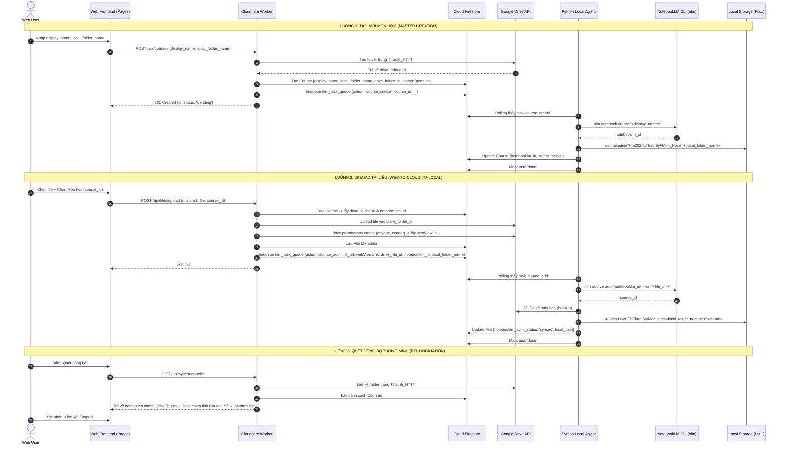

# Thiết Kế Kiến Trúc: Luồng Dữ Liệu 3 Chiều (Three-Way Sync Flows) & Tinh Gọn Cloudflare Workers

- **Ngày ban hành:** 2026-09-24
- **Tác giả:** Senior System Architect
- **Trạng thái:** Chờ phê duyệt (Under Review)
- **Mục tiêu:** Tinh gọn Cloudflare Workers, loại bỏ mã nguồn dư thừa/trùng lặp, áp dụng chuẩn thiết kế SOLID và hiện thực hóa Luồng Dữ Liệu 3 Chiều (Web UI <-> Cloudflare Worker / Firestore <-> Local Agent / Google Drive / NotebookLM).

---

## 1. Bối cảnh & Mục tiêu Kiến trúc (Context & Goals)

### 1.1. Hiện trạng & Vấn đề trong Cloudflare Workers
Qua quá trình rà soát mã nguồn `cloudflare/workers/src`:
1. **Trùng lặp cấu trúc & phân tán trách nhiệm (Vi phạm Single Responsibility Principle - SRP):**
   - Thư mục `src/routes/insights/` tồn tại song song với `src/routes/ai/`, gây chồng chéo API insights.
   - `src/lib/notebooks.js` chứa danh sách hardcode `SUBJECT_NOTEBOOK_MAP` với logic regex tiếng Việt để đoán notebook ID. Điều này vi phạm tính độc lập và mở rộng (Open/Closed Principle - OCP).
   - Quá trình upload file bị phân mảnh thành `upload_init.js` (tạo resumable session với user token) và `upload_complete.js` (hoàn tất và cấp quyền Drive), phụ thuộc vào client token vốn có tuổi thọ ngắn (60 phút).
2. **Thiếu tính tự chủ (Dependency Inversion - DIP):**
   - Worker chưa tận dụng Service Account JWT để chủ động tương tác Google Drive 24/7, dẫn đến phụ thuộc vào quyền token mà client cấp từ trình duyệt.

### 1.2. Mục tiêu cải tiến (Goal)
- **Clean Code & SOLID:** Tinh gọn các modules, xóa bỏ file dư thừa, xóa bỏ magic strings / hardcoded maps.
- **Tự động hóa 100% bằng Service Account:** Cloudflare Worker tự ký JWT để gọi Google Drive API (tạo folder môn học, upload file tài liệu, gán quyền Public Reader) mà không phụ thuộc vào trạng thái login token của trình duyệt.
- **Hiện thực hóa 3 Luồng Dữ Liệu Đồng Bộ Cốt Lõi:**
  1. *Master Creation Flow (Tạo môn học)*.
  2. *Web-to-Cloud-to-Local Flow (Upload tài liệu)*.
  3. *Discovery / Reconciliation Flow (Quét phát hiện & đối soát lệch dữ liệu)*.

---

## 2. Kế Hoạch Xóa Bỏ & Tinh Gọn Mã Nguồn Dư Thừa

| Đường dẫn tệp tin | Hành động | Lý do kiến trúc & SOLID |
| :--- | :---: | :--- |
| `cloudflare/workers/src/routes/insights/` | **XÓA BỎ** | Trùng lặp hoàn toàn với `src/routes/ai/insights`. Tích hợp trực tiếp vào router AI. |
| `cloudflare/workers/src/lib/notebooks.js` (phần mapping cũ) | **TINH GỌN / XÓA BỎ** | Xóa bỏ `SUBJECT_NOTEBOOK_MAP` và các hàm regex đoán tên. `notebooklm_id` luôn được đọc trực tiếp từ Course document. |
| `cloudflare/workers/src/routes/files/upload_init.js` | **XÓA BỎ** | Gộp vào `upload.js` duy nhất theo chuẩn RESTful. |
| `cloudflare/workers/src/routes/files/upload_complete.js` | **XÓA BỎ** | Gộp vào `upload.js` duy nhất, Worker tự upload Drive bằng Service Account. |
| `cloudflare/workers/src/lib/folders.js` (phân loại cũ) | **TINH GỌN** | Loại bỏ logic phân loại cứng (01_Giao_Trinh, 02_Slide,...), chỉ giữ lại helper làm sạch tên folder. |

---

## 3. Thiết Kế Chi Tiết Luồng Dữ Liệu 3 Chiều (Three-Way Sync Flows)



### 3.1. Luồng 1: Tạo mới Môn học (Master Creation Flow)
1. **Frontend Request**:
   - `POST /api/courses`
   - Payload:
     ```json
     {
       "display_name": "Kiến trúc Phần mềm Nâng cao",
       "local_folder_name": "Kien_Truc_Phan_Mem"
     }
     ```
2. **Worker xử lý**:
   - Sử dụng Google Service Account xác thực với Drive API `drive.files.create`:
     - `name`: `display_name`
     - `parents`: `[GOOGLE_DRIVE_ROOT_FOLDER_ID]` (thư mục `ThacSi_HTTT`)
     - `mimeType`: `application/vnd.google-apps.folder`
   - Nhận về `drive_folder_id`.
   - Ghi vào Firestore: `users/{uid}/courses/{courseId}`:
     ```json
     {
       "id": "course_uuid",
       "display_name": "Kiến trúc Phần mềm Nâng cao",
       "name": "Kiến trúc Phần mềm Nâng cao",
       "local_folder_name": "Kien_Truc_Phan_Mem",
       "drive_folder_id": "1A2B3C...",
       "notebooklm_id": "",
       "status": "pending",
       "created_at": "ISO_TIMESTAMP"
     }
     ```
   - Đẩy task vào `nlm_task_queue`:
     ```json
     {
       "id": "task_uuid",
       "action": "course_create",
       "course_id": "course_uuid",
       "display_name": "Kiến trúc Phần mềm Nâng cao",
       "local_folder_name": "Kien_Truc_Phan_Mem",
       "status": "pending"
     }
     ```
3. **Local Agent xử lý**:
   - Nhận task `course_create`:
     - Chạy `nlm notebook create "Kiến trúc Phần mềm Nâng cao"` -> nhận `notebooklm_id`.
     - Tạo thư mục: `Path(local_base_path) / "Kien_Truc_Phan_Mem"`.
     - Cập nhật Firestore document:
       `notebooklm_id = "nb_123..."`, `status = "active"`.
     - Báo cáo task `done`.

---

### 3.2. Luồng 2: Upload tài liệu qua Web (Web-to-Cloud-to-Local Flow)
1. **Frontend Request**:
   - `POST /api/files/upload`
   - FormData:
     - `file`: binary blob
     - `course_id`: ID của môn học được chọn từ Dropdown
2. **Worker xử lý**:
   - Tra cứu Course theo `course_id` từ Firestore, lấy `drive_folder_id` và `notebooklm_id`. Nếu course chưa có `drive_folder_id`, báo lỗi 400.
   - Upload file trực tiếp lên Google Drive vào thư mục `drive_folder_id` bằng Google Service Account.
   - Gán quyền Public Reader (`drive.permissions.create`: `type='anyone', role='reader'`).
   - Lấy `webViewLink` từ Google Drive.
   - Lưu metadata vào Firestore `users/{uid}/files/{fileId}`:
     `drive_file_id`, `drive_view_link`, `course_id`, `notebooklm_sync_status: 'pending'`.
   - Đẩy task vào `nlm_task_queue`:
     ```json
     {
       "id": "task_uuid",
       "action": "source_add",
       "file_id": "file_uuid",
       "filename": "Giao_trinh.pdf",
       "file_url": "https://drive.google.com/...",
       "drive_file_id": "drive_file_123",
       "notebooklm_id": "nb_123",
       "course_id": "course_uuid",
       "local_folder_name": "Kien_Truc_Phan_Mem",
       "status": "pending"
     }
     ```
3. **Local Agent xử lý**:
   - Đọc trực tiếp `notebooklm_id` và `file_url` từ task payload.
   - Thực thi CLI: `nlm source add <notebooklm_id> --url "<file_url>"`.
   - Đồng thời tải file vật lý về `H:\2026\Thac Sy\Mon_Hoc\<local_folder_name>\<filename>`.
   - Báo cáo hoàn tất task.

---

### 3.3. Luồng 3: Quét đồng bộ thông minh (Discovery / Reconciliation Flow)
1. **Endpoint `GET /api/sync/reconcile`**:
   - Worker gọi Google Drive API liệt kê toàn bộ subfolders trong `ThacSi_HTTT`.
   - So khớp `folder.id` với `courses` trên Firestore.
   - Các folder Drive chưa có trong Firestore được đánh dấu là `unimported_drive_folders` (đề xuất import thành môn học mới).
2. **Endpoint `POST /api/sync/import-drive-folder`**:
   - Cho phép người dùng bấm "Import môn này" từ Web UI: Worker tự động tạo record môn học trên Firestore, sinh task cho Local Agent tạo Notebook và thư mục Local tương ứng.

---

## 4. Áp Dụng Nguyên Tắc SOLID

1. **S - Single Responsibility Principle:**
   - Tạo mới module `lib/drive.js` chuyên trách xác thực Service Account JWT và các thao tác Google Drive (tạo folder, upload, set permission).
   - Tách biệt rõ ràng: `courses` quản lý môn học, `files/upload` quản lý nhận và nạp tệp tin, `sync` quản lý hàng đợi task và reconciliation.
2. **O - Open/Closed Principle:**
   - Hệ thống không phụ thuộc vào danh sách môn học cố định. Khi thêm môn học mới, không cần sửa đổi bất kỳ dòng mã nguồn nào trong code backend.
3. **L - Liskov Substitution Principle:**
   - Task payload trong `nlm_task_queue` tuân theo một schema duy nhất có định dạng chuẩn (`id`, `action`, `status`, `payload`).
4. **I - Interface Segregation Principle:**
   - Tách biệt API cho Web User (yêu cầu JWT / Google ID token) và API cho Local Agent (sử dụng Header `X-Agent-Secret`).
5. **D - Dependency Inversion Principle:**
   - Cloudflare Worker không phụ thuộc vào token của client mà chủ động tương tác với Drive và Firestore thông qua cấu hình `FIREBASE_SERVICE_ACCOUNT` dùng chung.

---

## 5. Kế Hoạch Triển Khai Tiếp Theo
1. **Trình duyệt đặc tả:** Chờ người dùng xem xét và phê duyệt bản thiết kế kiến trúc này.
2. **Lập Kế hoạch Thực thi (Implementation Plan):** Khởi tạo kế hoạch chi tiết từng bước (Step-by-step TDD Plan) để thực hiện tái cấu trúc `cloudflare/workers`.
3. **Triển khai & Kiểm thử:** Thực thi xóa code rác, cài đặt `lib/drive.js`, cập nhật `courses/index.js`, tạo `files/upload.js`, cập nhật `sync/reconcile.js`, chạy kiểm thử unit test tự động và build deploy lên Cloudflare.
